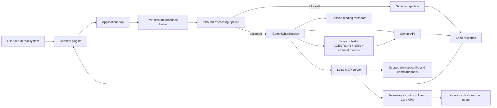

# Pillbug

<p align="center"></p>

[](https://opensource.org/licenses/MIT)
[](https://www.kaggle.com/experimental/sae/5dc91772-3e30-efa6-f325-22fd928212d6)

Pillbug is an async Python runtime for running a fleet of small, focused AI agents — one container per agent, each with the model, tools, and channels that job actually needs.

## Why Pillbug?

Pillbug is opinionated about one thing: **one agent, one job, one container.** Compose a Gemini Pro generalist that posts to Bluesky and Threads, a cheap local-Gemma worker that runs your cron-shaped tasks, and a Flash-powered personal assistant on Telegram — side by side, each with its own workspace, identity, and security boundary. They reach people through whichever channel fits (Telegram, Matrix, Slack, WebSocket, HTTP trigger), reach the world through MCP tools, and talk to each other over A2A when they need to.

Pick Pillbug when you want:

- **Fleet model** Each runtime is small, single-purpose, and disposable.
- **Reach where your users already are.** Telegram, Matrix, Slack — every channel is a plugin package.
- **A workspace-sandboxed tool surface.** File reads, edits, search, command execution, scheduling, and URL fetches all live behind a local MCP server.
- **Production posture out of the box.** Non-root container, reloadable security patterns, approval-gated mutating tools, structured JSON logs.
- **Backend flexibility per agent.** Gemini/Vertex natively; llama.cpp, vLLM, Ollama, LiteLLM via the bundled OpenAI-compatibility proxy. Mix tiers across the fleet — Pro where it earns its keep, Flash or local models where it doesn't.

Pillbug is probably **not** the right fit if you want a single mega-assistant with multi-tenant routing in one process, a bundled UI for end users, voice or video output flows, or a one-file demo.

## Example fleet

Three agents — different models, different jobs, different channels — on one host. Add a fourth by appending another service block.

```yaml
# compose.yaml
services:
  generalist:
    build: { context: ., target: final, args: { PILLBUG_INSTALL_EXTRAS: a2a,matrix } }
    env_file: ./generalist.env   # PB_GEMINI_MODEL=gemini-…-pro, Bluesky/Threads skills
    ports: ["8001:8000"]

  cron-worker:
    build: { context: ., target: final, args: { PILLBUG_INSTALL_EXTRAS: a2a,trigger,memory } }
    env_file: ./cron-worker.env  # PB_GEMINI_BASE_URL=…genai-proxy → local Gemma
    ports: ["8002:8000"]

  assistant:
    build: { context: ., target: final, args: { PILLBUG_INSTALL_EXTRAS: a2a,telegram } }
    env_file: ./assistant.env    # PB_GEMINI_MODEL=gemini-…-flash, personal Telegram bot
    ports: ["8003:8000"]
```

See [doc/multi/](doc/multi/) for fuller fleet examples including the operator dashboard and the OpenAI-compatibility proxy.

## Highlights

- A single agent per container, with its own runtime and workspace
- Async runtime with debounced inbound message handling
- Native audio recognition and vision support via multi-modal Gemini API
- Gemini developer and Vertex AI backends, plus OpenAI-compatible upstreams (llama.cpp, vLLM, Ollama, LiteLLM) through the bundled translation proxy
- Local MCP server for workspace file, search, command, outbound channel, and URL-fetching tools
- Approval-gated by default
- Structured tool-error envelopes and per-call audit telemetry with redacted args summaries
- Built-in session commands, summarization, and session-scoped planning
- Embedded scheduler for background agent tasks, with optional per-task goal contract (done condition, step cap, forbidden actions, progress log)
- Workspace skill discovery
- Optional channel and integration packages: A2A, Telegram, Slack, Matrix, WebSocket (Socket.IO), HTTP trigger, dashboard, bundled memory, and the OpenAI-compatibility proxy

## Quickstart

The fastest *is this real?* path. Requires Python 3.14+, [uv](https://docs.astral.sh/uv/), and a Gemini API key.

```bash
git clone https://github.com/m0nochr0me/pillbug.git
cd pillbug
uv sync --locked
export PB_GEMINI_API_KEY=your_api_key
./run.sh
```

The first run **exits intentionally** after seeding `~/.pillbug/workspace/AGENTS.md` and the runtime identity. This is normal — edit that file to set your agent persona, then run `./run.sh` again to start the CLI channel.

For Docker, multi-runtime setups, optional channel extras, or external memory, see [doc/INSTALL.md](doc/INSTALL.md).

## Docs

*Ask your existing coding agent to follow the installation instructions and deploy a runtime!*

- Installation: [doc/INSTALL.md](doc/INSTALL.md)
- Configuration reference: [doc/CONFIGURATION.md](doc/CONFIGURATION.md)
- Example deployment files: `doc/simple/` and `doc/multi/`

## Architecture



## Memory Management

Memory lives outside core so each runtime can pick the tier that fits. Three options ship in-tree:

- **Bundled (simple)** — install the `memory` extra for flat-Markdown CRUD under `workspace/memory/` exposed through five MCP tools (`memory_list`, `memory_get`, `memory_add`, `memory_update`, `memory_delete`). Stdlib-only, no database. Good default for single-runtime setups. See [packages/pillbug-memory](packages/pillbug-memory).
- **External (graph + semantic)** — [Arca-Memory](https://github.com/arca-mem/arca-memory) is a recommended compatible MCP service for buckets, semantic search, and graph traversal. Wire it in through `mcp.json`.
- **Custom** — bring any other MCP server, or implement memory inside a workspace skill.

## Optional Packages

Workspace members under `packages/` are installed through uv extras and registered as channel plugins or standalone services. See [doc/INSTALL.md](doc/INSTALL.md) and each package README for details.

| Extra | Package | Purpose |
| - | - | - |
| `a2a` | [pillbug-a2a](packages/pillbug-a2a) | Agent-to-agent HTTP channel with peer discovery |
| `telegram` | [pillbug-telegram](packages/pillbug-telegram) | Telegram bot channel |
| `slack` | [pillbug-slack](packages/pillbug-slack) | Slack channel over Socket Mode (no public HTTP endpoint required) |
| `matrix` | [pillbug-matrix](packages/pillbug-matrix) | Matrix channel with attachment, voice-message, and typing support |
| `websocket` | [pillbug-websocket](packages/pillbug-websocket) | Socket.IO channel keyed by client-provided ULID session IDs |
| `trigger` | [pillbug-trigger](packages/pillbug-trigger) | HTTP ingress for external event sources with per-source prompt templates |
| `dashboard` | [pillbug-dashboard](packages/pillbug-dashboard) | Operator dashboard service |
| `genai_proxy` | [pillbug-genai-proxy](packages/pillbug-genai-proxy) | Gemini wire-format proxy that fronts any OpenAI-compatible chat completions endpoint |
| `claude_api_proxy` | [pillbug-claude-api-proxy](packages/pillbug-claude-api-proxy) | Gemini wire-format proxy that fronts Claude through the Anthropic Messages API, billed against a Claude Pro/Max subscription via the Claude Code OAuth token |
| `memory` | [pillbug-memory](packages/pillbug-memory) | Bundled flat-file Markdown memory store with five MCP tools, rooted in `workspace/memory/` |

The `gmail` extra is a skill-side extra (not a workspace package): it installs the Google API client deps consumed by the bundled [skills/gmail](skills/gmail) workspace skill.

## Bundled Skills

Pillbug ships eight workspace skills under [skills/](skills). The runtime auto-discovers them when they're copied into `<runtime-base>/workspace/skills/` (see [doc/INSTALL.md](doc/INSTALL.md)); each one is a directory with a `SKILL.md` whose frontmatter Pillbug parses at startup.

| Skill | Purpose |
| - | - |
| [arca-memory](skills/arca-memory) | Operating guide for the Arca-Memory MCP service (buckets, semantic search, graph traversal) |
| [bluesky](skills/bluesky) | Publish posts to Bluesky |
| [feed-reader](skills/feed-reader) | RSS/Atom subscriptions: list new posts, fetch full text, manage feed lists |
| [financial-assistant](skills/financial-assistant) | Track personal expenses to a CSV ledger with live exchange-rate normalization |
| [gmail](skills/gmail) | Read Gmail mailboxes via a service account with domain-wide delegation (read-only) |
| [tavily-search](skills/tavily-search) | Web search through the Tavily API, with a bundled shell wrapper |
| [text-to-speech](skills/text-to-speech) | Synthesize speech from text via ElevenLabs |
| [threads](skills/threads) | Publish posts to Threads (Meta) |

Most skills need their own credentials (Bluesky app password, Tavily API key, ElevenLabs key, Gmail service account, etc.) — see each skill's `SKILL.md`. The `gmail` skill additionally requires `uv sync --extra gmail` for the Google API client deps. Drop unwanted skills before copying, or remove them from the runtime workspace at any time.

## OpenAI-compatible Backends

Pillbug speaks the Gemini wire format directly, but the `pillbug-genai-proxy` extra ships a small FastAPI translator that exposes `POST /v1beta/models/{model}:generateContent` and forwards translated requests to an OpenAI-compatible upstream (llama.cpp, vLLM, LiteLLM, Ollama, etc.). Point the runtime at the proxy with `PB_GEMINI_BASE_URL` and keep the rest of the Gemini-first chat session, MCP tools, and AFC behavior unchanged. See [packages/pillbug-genai-proxy/README.md](packages/pillbug-genai-proxy/README.md) for the supported translation surface.

## Claude (subscription-billed) Backend

The `claude_api_proxy` extra ships a sibling FastAPI translator, `pillbug-claude-api-proxy`, that fronts Claude through the official [Anthropic Python SDK](https://github.com/anthropics/anthropic-sdk-python). Calls are billed against your **Claude Pro/Max subscription** via the Claude Code OAuth token (`claude setup-token`), not against Anthropic API credits. Same `PB_GEMINI_BASE_URL` switch — only the upstream changes. See [packages/pillbug-claude-api-proxy/README.md](packages/pillbug-claude-api-proxy/README.md) for the supported surface and the load-bearing system-prompt prefix the OAuth path requires.

## Limitations

- Only HTTP MCP servers are supported at this time.
- Matrix support currently runs without end-to-end encryption.
