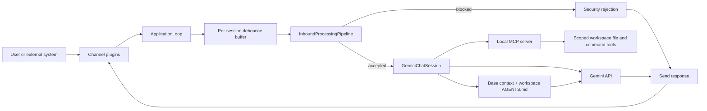

# Pillbug

<p align="center"></p>

Pillbug is an async AI agent runtime built for isolated deployment.

## Highlights

- One agent, one runtime, and one workspace per container
- Async runtime with debounced inbound message handling
- Built-in CLI channel plus factory-based external channel plugins
- uv workspace-friendly plugin layout for optional channel packages
- Local MCP server for workspace file, search, command, and outbound channel tools
- URL fetching tool with streamed size limits and readable HTML snapshots
- Session-scoped todo planning tool for multi-step agent work
- Embedded Docket worker for scheduled background AI tasks
- Read-only HTTP telemetry endpoints plus an SSE event stream for external dashboards
- Per-workspace `AGENTS.md` instructions seeded on first run

## Quick Start

Pillbug targets Python 3.14+ and uses `uv` for dependency management.

```bash
uv sync --locked
export PB_GEMINI_API_KEY=your_api_key
./run.sh
```

Alternative launch commands:

```bash
uv run python -m app
uv run python -m app.mcp
```

On first run, Pillbug initializes `~/.pillbug/workspace/AGENTS.md`. That file is included in the system instruction for model requests.

## Philosophy

Pillbug is intentionally not a shared multi-agent super-app. The project is aimed at running isolated agents that can be composed at the deployment layer without collapsing into a single runtime.

Current and intended direction:

- Keep one agent, one runtime, and one workspace per container
- Keep runtime state local to the container unless a feature explicitly needs network communication
- Add cross-runtime cooperation through explicit A2A channels rather than shared sessions or shared workspaces
- Expose telemetry and narrow control endpoints so a separate dashboard app can observe and operate agents from another container
- Keep the runtime useful in headless deployments without requiring a bundled web UI

## Architecture



Runtime flow:

- `app/__main__.py` initializes the workspace, starts the local MCP server, and runs the application loop.
- `app/runtime/loop.py` listens on each channel, groups messages by session, and reuses one chat session per session key.
- `app/runtime/pipeline.py` cleans input, runs security checks, and builds the structured model input.
- `app/mcp.py` exposes workspace-safe file, command, outbound messaging, URL-fetching, and todo-planning tools to the model.

External executions can also deliver messages through the local MCP server with `send_message(channel, message)`.
Use `cli` for the local console, or a session-style target such as `telegram:123456789` where the suffix is the
channel conversation identifier.

## Planning

Pillbug exposes a session-scoped MCP planning tool named `manage_todo_list` for complex, multi-step work.

Use these actions:

- `get` to inspect the current todo list
- `set` to replace the full todo list atomically
- `clear` to remove the current todo list

The tool validates that todo item ids are unique and that there is at most one `in-progress` item at a time.
Todo state is scoped to the active MCP session, so each active agent conversation keeps its own plan.

## Configuration

Common environment variables:

- `PB_GEMINI_API_KEY` for Gemini access
- `PB_RUNTIME_ID` to pin a stable runtime identifier explicitly; when omitted, Pillbug persists one at `~/.pillbug/runtime_id.txt`
- `PB_AGENT_NAME` to attach an operator-facing agent label to runtime telemetry
- `PB_DASHBOARD_BEARER_TOKEN` to protect the dashboard telemetry APIs and the upcoming control APIs with a single dashboard-scoped bearer token
- `PB_A2A_BEARER_TOKEN` to protect runtime-to-runtime A2A ingress with a peer-scoped bearer token
- `PB_ENABLED_CHANNELS` to enable `cli` and registered external channels
- `PB_CHANNEL_PLUGIN_FACTORIES` for `channel=package.module:factory` plugin mappings
- `PB_A2A_SELF_BASE_URL` to advertise the externally reachable base URL peers should use for replies
- `PB_A2A_PEERS_JSON` to register known peer runtimes and their base URLs for outbound A2A delivery
- `PB_A2A_CONVERGENCE_MAX_HOPS` to bound automatic cross-runtime reply chains before Pillbug stops the exchange
- `PB_A2A_AGENT_DESCRIPTION`, `PB_A2A_PROVIDER_ORGANIZATION`, `PB_A2A_PROVIDER_URL`, `PB_A2A_DOCUMENTATION_URL`, and `PB_A2A_ICON_URL` to populate the published A2A Agent Card
- `PB_SECURITY_PATTERNS_PATH` to tune inbound warning and block regexes loaded by the pipeline at runtime startup and on file change
- `PB_WORKSPACE_ROOT` to change the runtime workspace location
- `PB_INBOUND_DEBOUNCE_SECONDS` to tune message batching behavior
- `PB_DOCKET_URL` to point scheduled tasks at a dedicated Redis-backed docket
- `PB_MCP_FETCH_URL_MAX_BYTES` to cap streamed URL downloads before they are saved
- `PB_MCP_FETCH_URL_OUTPUT_DIR` to choose where fetched resources are written inside the workspace
- `PB_MCP_FETCH_URL_TIMEOUT_SECONDS` to tune remote fetch timeouts

## Telemetry API

Pillbug now exposes read-only runtime telemetry alongside the MCP HTTP server.

Available endpoints:

- `GET /health`
- `GET /telemetry/runtime`
- `GET /telemetry/channels`
- `GET /telemetry/sessions`
- `GET /telemetry/tasks`
- `GET /telemetry/events`

`GET /telemetry/events` uses Server-Sent Events and emits an initial runtime snapshot followed by live runtime, session, channel, and scheduler events.

When `PB_DASHBOARD_BEARER_TOKEN` is configured, these endpoints require `Authorization: Bearer <token>`.

## Scheduled Tasks

Pillbug includes an embedded Docket worker for background agent tasks. Tasks are persisted in `~/.pillbug/tasks/agent_tasks.json`, and each task executes in its own Gemini session keyed by the task identifier.

Use the MCP tool `manage_agent_task` with these actions:

- `create` to add a new task
- `list` to inspect all tasks
- `get` to inspect one task
- `update` to change the prompt, schedule, or enabled flag
- `delete` to remove a task

Supported task types:

- `cron` with `cron_expression`
- `delayed` with `delay_seconds`; these are one-shot by default and only repeat when `repeat=true` is explicitly configured

Each scheduled execution receives a task-specific JSON response contract. One-shot delayed tasks are cancelled after execution even if the model tries to continue them; repeat-enabled delayed tasks may reschedule themselves with `{"action": "continue"}`.
Task session identifiers are assigned automatically from the task id and are not part of the MCP management interface.

## Workspace Plugins

Pillbug can keep optional integrations as separate uv workspace members under `packages/`. This fits the existing
factory-based channel loader well: the root runtime stays generic, while each plugin ships its own dependencies and
exports a factory callable.

The repository now includes `packages/pillbug-telegram`, a Telegram long-polling channel implemented with `shingram`.
The root package exposes that plugin through the `telegram` extra, so the runtime only installs it when requested.

The repository also includes `packages/pillbug-a2a`, an HTTP-based runtime-to-runtime channel.
It keeps cross-runtime traffic in the normal inbound message pipeline instead of introducing remote tool execution.

Example setup:

```bash
uv sync --extra telegram
export PB_ENABLED_CHANNELS=cli,telegram
export PB_CHANNEL_PLUGIN_FACTORIES=telegram=pillbug_telegram.telegram_channel:create_channel
export PB_TELEGRAM_BOT_TOKEN=your_bot_token
uv run python -m app
```

Example A2A setup:

```bash
uv sync --extra a2a
export PB_ENABLED_CHANNELS=cli,a2a
export PB_CHANNEL_PLUGIN_FACTORIES=a2a=pillbug_a2a.a2a_channel:create_channel
export PB_A2A_SELF_BASE_URL=http://runtime-a:8000
export PB_A2A_BEARER_TOKEN=shared-a2a-bearer-token
export PB_A2A_CONVERGENCE_MAX_HOPS=6
export PB_A2A_PEERS_JSON='[{"runtime_id":"runtime-b","base_url":"http://runtime-b:8000"}]'
uv run python -m app
```

Outbound A2A targets use the form `a2a:runtime-id/conversation-id`.
Inbound peer traffic is accepted on `POST /a2a/messages` and converted into normal `InboundMessage` values before the application loop processes it.
Automatic outbound replies are limited by `PB_A2A_CONVERGENCE_MAX_HOPS`, and Pillbug suppresses automatic follow-up messages for terminal A2A intents such as `result`, `inform`, `error`, and `heartbeat`.

Agent Card discovery is published at `GET /.well-known/agent-card.json`.
Published cards advertise the runtime's concrete built-in capabilities and also include any custom workspace skills discovered from `skills/*/SKILL.md`.
When `PB_A2A_BEARER_TOKEN` is configured, Pillbug also serves `GET /extendedAgentCard` behind the same bearer token and includes the convergence rules as an A2A extension.

Optional Telegram-specific settings:

- `PB_TELEGRAM_ALLOWED_UPDATES` as a CSV list such as `message,edited_message`
- `PB_TELEGRAM_POLL_TIMEOUT_SECONDS` for long-poll timeout tuning
- `PB_TELEGRAM_POLL_LIMIT` for each `getUpdates` batch size
- `PB_TELEGRAM_REPLY_TO_MESSAGE` to control whether replies are threaded to the inbound message
- `PB_TELEGRAM_DELETE_WEBHOOK_ON_START` and `PB_TELEGRAM_DROP_PENDING_UPDATES` when switching a bot from webhook mode to polling
