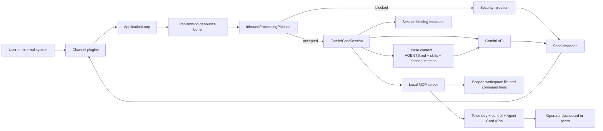

# Pillbug

Pillbug is an async AI agent runtime built for isolated deployment.

## Highlights

- One agent, one runtime, and one workspace per container
- Async runtime with debounced inbound message handling
- Native audio recognition and vision support via multi-modal Gemini API
- Local MCP server for workspace file, search, command, outbound channel, and URL-fetching tools
- Built-in session commands, summarization, and session-scoped planning
- Embedded scheduler for background agent tasks
- Workspace skill discovery from `skills/*/SKILL.md`
- Optional A2A, Telegram, and dashboard packages
- Per-workspace `AGENTS.md` instructions seeded on first run

## Docs

*Ask your existing coding agent to follow the installation instructions and deploy a runtime!*

- Installation: [doc/INSTALL.md](doc/INSTALL.md)
- Configuration reference: [doc/CONFIGURATION.md](doc/CONFIGURATION.md)
- Example deployment files: `doc/simple/` and `doc/multi/`

## Architecture

## Memory Management

Pillbug has not bundled memory management features intentionally to allow users to choose their preferred approach.

[Arca-Memory](https://github.com/arca-mem/arca-memory) is a *recommended* compatible external memory management service that can be easily integrated via the MCP tools API.

Users can also implement custom memory management solutions by using agent skills or other MCP servers.

## Limitations

- Currently only supports Gemini API for agent interactions. Support for additional LLM providers may be added in the future based on demand.
- Only HTTP MCP servers are supported at this time.
- So far only Telegram is supported as a non-CLI channel, but additional channels can be added via the plugin system.
