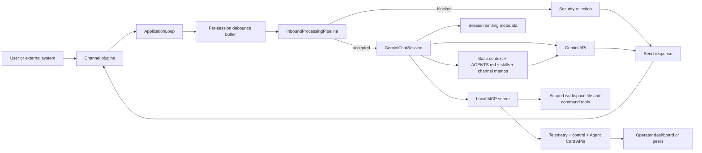

# Pillbug

Pillbug is an async AI agent runtime built for isolated deployment.

## Highlights

- One agent, one runtime, and one workspace per container
- Async runtime with debounced inbound message handling
- Native audio recognition and vision support via multi-modal Gemini API
- Gemini developer and Vertex AI backends, plus OpenAI-compatible upstreams (llama.cpp, vLLM, Ollama, LiteLLM) through the bundled translation proxy
- Local MCP server for workspace file, search, command, outbound channel, and URL-fetching tools
- Built-in session commands, summarization, and session-scoped planning
- Embedded scheduler for background agent tasks
- Workspace skill discovery from `skills/*/SKILL.md`
- Optional channel and integration packages: A2A, Telegram, Matrix, WebSocket (Socket.IO), HTTP trigger, dashboard, and the OpenAI-compatibility proxy
- Per-workspace `AGENTS.md` instructions seeded on first run

## Docs

*Ask your existing coding agent to follow the installation instructions and deploy a runtime!*

- Installation: [doc/INSTALL.md](doc/INSTALL.md)
- Configuration reference: [doc/CONFIGURATION.md](doc/CONFIGURATION.md)
- Example deployment files: `doc/simple/` and `doc/multi/`

## Architecture

## Memory Management

Pillbug has not bundled memory management features intentionally to allow users to choose their preferred approach.

[Arca-Memory](https://github.com/arca-mem/arca-memory) is a *recommended* compatible external memory management service that can be easily integrated via the MCP tools API.

Users can also implement custom memory management solutions by using agent skills or other MCP servers.

## Optional Packages

Workspace members under `packages/` are installed through uv extras and registered as channel plugins or standalone services. See [doc/INSTALL.md](doc/INSTALL.md) and each package README for details.

| Extra | Package | Purpose |
| - | - | - |
| `a2a` | [pillbug-a2a](packages/pillbug-a2a) | Agent-to-agent HTTP channel with peer discovery |
| `telegram` | [pillbug-telegram](packages/pillbug-telegram) | Telegram bot channel |
| `matrix` | [pillbug-matrix](packages/pillbug-matrix) | Matrix channel with attachment, voice-message, and typing support |
| `websocket` | [pillbug-websocket](packages/pillbug-websocket) | Socket.IO channel keyed by client-provided ULID session IDs |
| `trigger` | [pillbug-trigger](packages/pillbug-trigger) | HTTP ingress for external event sources with per-source prompt templates |
| `dashboard` | [pillbug-dashboard](packages/pillbug-dashboard) | Operator dashboard service |
| `genai_proxy` | [pillbug-genai-proxy](packages/pillbug-genai-proxy) | Gemini wire-format proxy that fronts any OpenAI-compatible chat completions endpoint |

## OpenAI-compatible Backends

Pillbug speaks the Gemini wire format directly, but the `pillbug-genai-proxy` extra ships a small FastAPI translator that exposes `POST /v1beta/models/{model}:generateContent` and forwards translated requests to an OpenAI-compatible upstream (llama.cpp, vLLM, LiteLLM, Ollama, etc.). Point the runtime at the proxy with `PB_GEMINI_BASE_URL` and keep the rest of the Gemini-first chat session, MCP tools, and AFC behavior unchanged. See [packages/pillbug-genai-proxy/README.md](packages/pillbug-genai-proxy/README.md) for the supported translation surface.

## Limitations

- Streaming (`:streamGenerateContent`) and Gemini file uploads are not translated by the OpenAI-compatibility proxy.
- Only HTTP MCP servers are supported at this time.
- Matrix support currently runs without end-to-end encryption.
