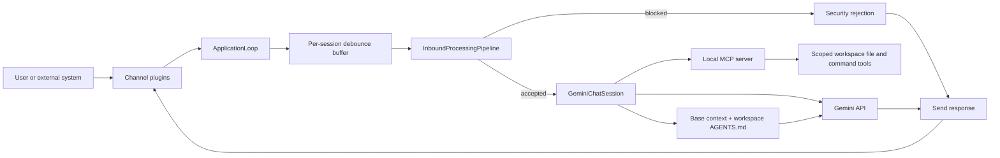

# Pillbug

<p align="center"></p>

Pillbug is an async AI agent runtime.

## Highlights

- Async runtime with debounced inbound message handling
- Built-in CLI channel plus factory-based external channel plugins
- uv workspace-friendly plugin layout for optional channel packages
- Local MCP server for workspace file, search, command, and outbound channel tools
- Per-workspace `AGENTS.md` instructions seeded on first run

## Quick Start

Pillbug targets Python 3.14+ and uses `uv` for dependency management.

```bash
uv sync --locked
export PB_GEMINI_API_KEY=your_api_key
./run.sh
```

Alternative launch commands:

```bash
uv run python -m app
uv run python -m app.mcp
```

On first run, Pillbug initializes `~/.pillbug/workspace/AGENTS.md`. That file is included in the system instruction for model requests.

## Architecture



Runtime flow:

- `app/__main__.py` initializes the workspace, starts the local MCP server, and runs the application loop.
- `app/runtime/loop.py` listens on each channel, groups messages by session, and reuses one chat session per session key.
- `app/runtime/pipeline.py` cleans input, runs security checks, and builds the structured model input.
- `app/mcp.py` exposes workspace-safe file and command tools to the model.

External executions can also deliver messages through the local MCP server with `send_message(channel, message)`.
Use `cli` for the local console, or a session-style target such as `telegram:123456789` where the suffix is the
channel conversation identifier.

## Configuration

Common environment variables:

- `PB_GEMINI_API_KEY` for Gemini access
- `PB_ENABLED_CHANNELS` to enable `cli` and registered external channels
- `PB_CHANNEL_PLUGIN_FACTORIES` for `channel=package.module:factory` plugin mappings
- `PB_WORKSPACE_ROOT` to change the runtime workspace location
- `PB_INBOUND_DEBOUNCE_SECONDS` to tune message batching behavior

## Workspace Plugins

Pillbug can keep optional integrations as separate uv workspace members under `packages/`. This fits the existing
factory-based channel loader well: the root runtime stays generic, while each plugin ships its own dependencies and
exports a factory callable.

The repository now includes `packages/pillbug-telegram`, a Telegram long-polling channel implemented with `shingram`.
The root package exposes that plugin through the `telegram` extra, so the runtime only installs it when requested.

Example setup:

```bash
uv sync --extra telegram
export PB_ENABLED_CHANNELS=cli,telegram
export PB_CHANNEL_PLUGIN_FACTORIES=telegram=pillbug_telegram.telegram_channel:create_channel
export PB_TELEGRAM_BOT_TOKEN=your_bot_token
uv run python -m app
```

Optional Telegram-specific settings:

- `PB_TELEGRAM_ALLOWED_UPDATES` as a CSV list such as `message,edited_message`
- `PB_TELEGRAM_POLL_TIMEOUT_SECONDS` for long-poll timeout tuning
- `PB_TELEGRAM_POLL_LIMIT` for each `getUpdates` batch size
- `PB_TELEGRAM_REPLY_TO_MESSAGE` to control whether replies are threaded to the inbound message
- `PB_TELEGRAM_DELETE_WEBHOOK_ON_START` and `PB_TELEGRAM_DROP_PENDING_UPDATES` when switching a bot from webhook mode to polling
